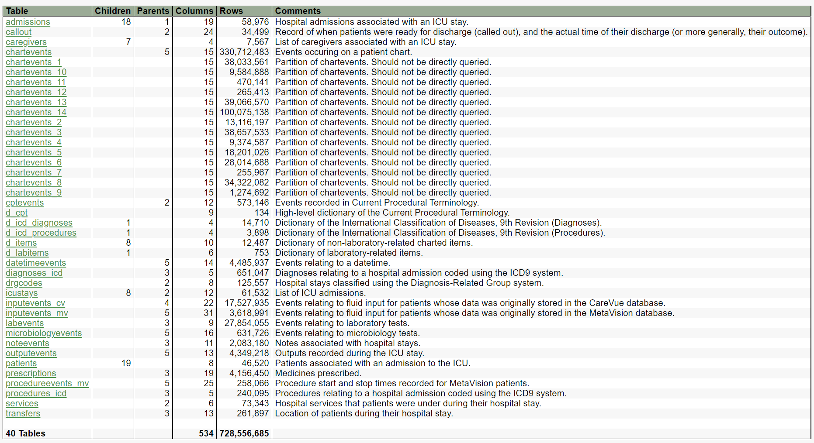
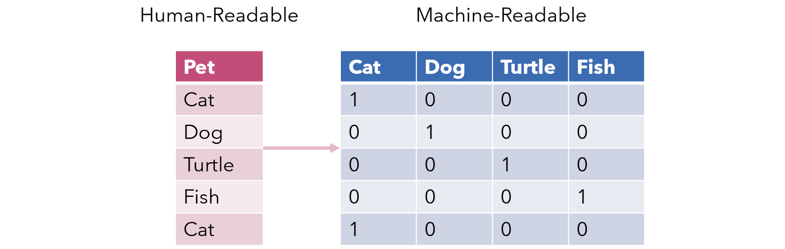
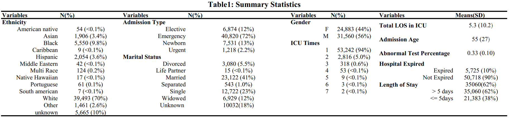
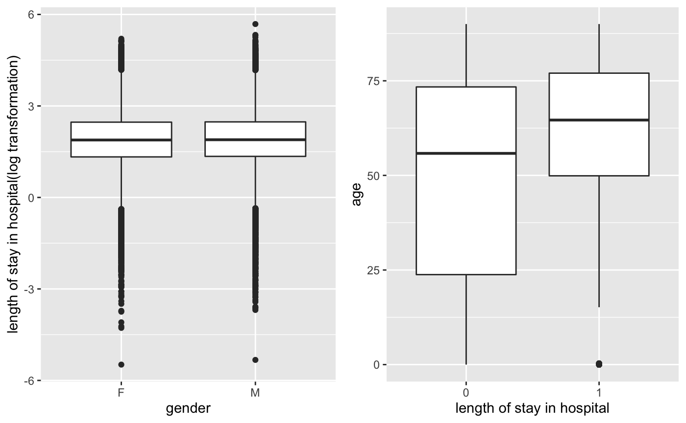
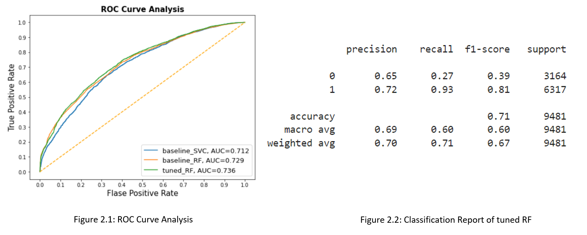

# Classifying Length of Stay Using Patient Information: Model Development and Validation on MIMIC-III Clinical Database

Group 8: Yuxuan Chen, Limeng Liu, Qiaoxue Liu, Weizhou Qian

Detailed report can be found [here](./Group_8_Report_Classifying_LoS_on_MIMIC.pdf)

---
## Table of Contents
- [Project Description](#project-description)
- [Methods](#methods)
  - [Data Processing Steps](#data-processing-steps)
  - [Machine Learning Methods](#machine-learning-methods)
  - [One-Hot](#one-hot)
    - [Support Vector Machine](#support-vector-machine)
    - [Random Forest](#random-forest)
    - [GridSearchCV](#gridsearchcv)
    - [Cross-Validation](#cross-validation)
- [Results](#results)
  - [Merged Data Description](#merged-data-description)
  - [Classification](#classification)
    - [SVM(exclude diagnosis)](#svmexclude-diagnosis)
    - [Random Forest (exclude diagnosis)](#random-forest-exclude-diagnosis)
    - [Random Forest (include diagnosis)](#random-forest-include-diagnosis)
- [Discussion](#discussion)
- [References](#references)

---
## Project Description

Hospital beds, wards and laboratories are important health care resources with limited availability. Inefficient health resources management will result in lower profits for hospitals and overall higher costs for society. Prolonged waiting time and care delays could also be the problems. To deal with those issues, we think the length of stay(LOS) will be a good indicator since it explains up to 90% interpatient variation in hospital costs. 

In this project, The Medical Information Mart for Intensive Care III (MIMIC-III), a large, real-world and de-identified collection of medical records, is used. There are over 700 million rows in all 40 tables in the original dataset. After selecting and literature reviewing, we finally decide to use 6 of them. 

The following is the schema of MIMIC-III:

**Although MIMIC-III is publicly-available database, it has restriction and cannot be public without premission. Therefore, we do not include datasets in this GitHub page.**

---

## Methods
### Data Processing Steps
Because of the large amount of data, it is difficult to perform data processing, analyzing, and modeling in a local computing machine. Thus, we plan to use the following steps described below for both high efficiency and promising accuracy: 

- (1) download the demo data to local machine
- (2) process the demo data and save processing scripts
- (3) use the query builder to extract a relatively large dataset
- (4) test scripts in the large local dataset, fix any issues and optimize the code to get the highest efficiency
- (5) use the biostatistics cluster or google cloud to access the entire MIMIC-III dataset, which is approximately 7GB in total
- (6) implement a bash script to unzip the data folder and subfolders to find the tables needed
- (7) implement the script in server for extracting and processing
- (8) use cloud computing to implement several machine learning models on a dataset
- (9) tuning hyperparameters of machine learning models
- (10) return the results and metrics
- (11) compare the accuracy and other metrics between different models.

Processing scripts can be found in "data_processing" folder.

### Machine Learning Methods
### One-Hot
One-hot encoding methods are used for processing categorical variables. In avoiding using factorization (assign integers for categories which will make models misunderstanding that bigger number indicates more important), one-hot can help with unbiased categorization.
An image illustration of one-hot shown below:

#### Support Vector Machine
Support vector machines (SVMs) are a set of supervised learning methods used for classification, regression, and outlier detection . In our project, SVM is used for classifying the length of stays as long (greater than 5 days) and short (less or equal than 5 days) with basic parameters. 

#### Random Forest
A random forest is a meta estimator that fits several decision tree classifiers on various sub-samples of the dataset and uses averaging to improve the predictive accuracy and control over-fitting and is also conducted in this project. 

#### GridSearchCV
To improve the accuracy of the classification results, a method named GridSearchCV helps tune hyperparameters in the machine learning models. By listing all candidates for each hyperparameter and fitting with all combinations, it will allow the selection of the best parameters automatically with evaluation results for each parameter candidate. 

#### Cross-Validation
Cross-validation is a resampling method that uses different portions of the data to test and train a model on different iterations. Using the 5-fold cross-validation and calculation of the average accuracy score will help to get unbiased validation and evaluation results.

## Results
see more details in [Classifying_LoS_ML_mimic3.ipynb](./models/Classifying_LoS_ML_mimic3.ipynb)

### Merged Data Description
The original data includes 58976 observations with 11573 missing values. When exclude "diagnosis" as a variable, there are 33 columns in total; when include "diagnosis", there are 14566 columns.

Summary of data statisics is shown as below:

We are also interested to see how demographic factors, for example, gender and age, will impact on the length of stay. Boxplots for gender and age are shown as below:

### Classification
outcome variable: y: (length of stay in hospital > 5 days)

80% of the data are used for training and 20% of them are used for testing.

#### SVM(exclude diagnosis)
With 5 fold cv, the unbiased accuracy score is around 0.6966.

#### Random Forest (exclude diagnosis)
With 5 fold cv, the unbiased accuracy score is around 0.6964.

Turning for 24 pairs of hyperparameters, with 120 fittings, the best pair of hyperparameter results in AUC=0.74.

The following Graph shows the comparison between `baseline-SVC`, `baseline-RF`, `tuned-RF` in same training and testing dataset, with their ROC and AUC displayed:

In the above figure, the classfication report of tuned RF is also showed on the right side. 

#### Random Forest (include diagnosis)
With the same procedure but include diagnosis as a variable, the best pair of hyperparameter results in AUC=0.71 after testing for 24 pairs of hyperparameters.

**Detailed interpretation of model returns and comparison between models are discussed in the final report**

---

## Discussion
Drawbacks from having to many predictors: when the diagnosis is included in the dataset of training, the model did not improve the accuracy, but lowered the efficiency. 

Limitations:
- admission id as a unique identifier for each observation, however each patient can come with multiple admission id 
- the percentage of abnormal lab tests is calcuated based on the  hypotheses that for the same disease/initial diagnosis, all doctors will order the same lab tests
- age over 89 is hidden and we imupted as 90 
- MIMIC dataset was collected only in one hospital in Boston, location will not be a variable in our project, but a potentially significant cause 

---
## References
[1] Rapoport, John, et al. “Length of Stay Data as a Guide to Hospital Economic Performance for ICU Patients.” Medical Care, vol. 41, no. 3, Mar. 2003, pp. 386–397., https://doi.org/10.1097/01.mlr.0000053021.93198.96.   
[2] Mekhaldi R.N., Caulier P., Chaabane S., Chraibi A., Piechowiak S. (2020) Using Machine Learning Models to Predict the Length of Stay in a Hospital Setting. In: Rocha Á., Adeli H., Reis L., Costanzo S., Orovic I., Moreira F. (eds) Trends and Innovations in Information Systems and Technologies. WorldCIST 2020. Advances in Intelligent Systems and Computing, vol 1159. Springer, Cham. https://doi.org/10.1007/978-3-030-45688-7_21  
[3] Liu Yingxin , Phillips Mike Codde Jim (2001) Factors influencing patients' length of stay. Australian Health Review 24, 63-70., https://doi.org/10.1071/AH010063  
[4] Kelly, Maria, et al. “Factors Predicting Hospital Length-of-Stay and Readmission after Colorectal Resection: A Population-Based Study of Elective and Emergency Admissions.” BMC Health Services Research, BioMed Central, 26 Mar. 2012, https://link.springer.com/article/10.1186/1472-6963-12-77.  
[5] Wang, Ying, et al. “Factors Associated with a Prolonged Length of Stay after Acute Exacerbation of Chronic Obstructive Pulmonary Disease (AECOPD).” International Journal of Chronic Obstructive Pulmonary Disease, Dove Medical Press, 20 Jan. 2014, https://www.ncbi.nlm.nih.gov/pmc/articles/PMC3901775/.  
[6] Yoon, Philip, et al. “Analysis of Factors Influencing Length of Stay in the Emergency Department.” Canadian Journal of Emergency Medicine, vol. 5, no. 3, 2003, pp. 155–161., doi:10.1017/S1481803500006539.  
[7] T. Gentimis, A. J. Alnaser, A. Durante, K. Cook and R. Steele, "Predicting Hospital Length of Stay Using Neural Networks on MIMIC III Data," 2017 IEEE 15th Intl Conf on Dependable, Autonomic and Secure Computing, 15th Intl Conf on Pervasive Intelligence and Computing, 3rd Intl Conf on Big Data Intelligence and Computing and Cyber Science and Technology Congress(DASC/PiCom/DataCom/CyberSciTech), 2017, pp. 1194-1201, doi: 10.1109/DASC-PICom-DataCom-CyberSciTec.2017.191.  
[8] B. Thompson, K. O. Elish and R. Steele, "Machine Learning-Based Prediction of Prolonged Length of Stay in Newborns," 2018 17th IEEE International Conference on Machine Learning and Applications (ICMLA), 2018, pp. 1454-1459, doi: 10.1109/ICMLA.2018.00236.  
[9] Johnson, A., Pollard, T., Shen, L. et al. MIMIC-III, a freely accessible critical care database. Sci Data 3, 160035 (2016). https://doi.org/10.1038/sdata.2016.35  
[10] Felipe_Torres. “Query Builder v1.2.” Query Builder, https://querybuilder-lcp.mit.edu/.   
[11] “1.4. Support Vector Machines.” Scikit, https://scikit-learn.org/stable/modules/svm.html#:~:text=Support%20vector%20machines%20(SVMs)%20are,than%20the%20number%20of%20samples.   
[12] “Sklearn.ensemble.randomforestclassifier.” Scikit, https://scikit-learn.org/stable/modules/generated/sklearn.ensemble.RandomForestClassifier.html.   

